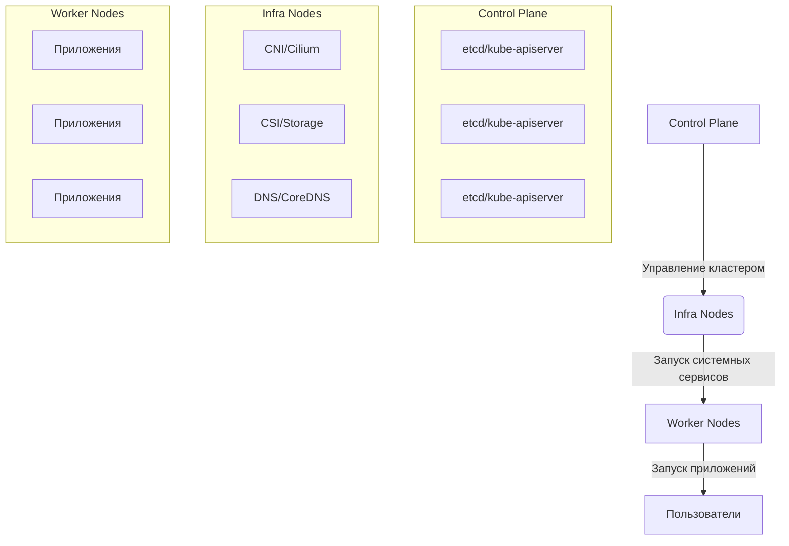

# Инфраструктурная роль для Talos Kubernetes

- [Инфраструктурная роль для Talos Kubernetes](#инфраструктурная-роль-для-talos-kubernetes)
  - [Зачем нужен этот компонент](#зачем-нужен-этот-компонент)
  - [Архитектура нод в кластере](#архитектура-нод-в-кластере)
  - [Компоненты, переносимые на infra-ноды](#компоненты-переносимые-на-infra-ноды)
  - [Логика работы](#логика-работы)
  - [Требования](#требования)
  - [Валидация установки](#валидация-установки)
  - [Производственные рекомендации](#производственные-рекомендации)

## Зачем нужен этот компонент

Этот компонент обеспечивает **стратегическое разделение обязанностей** в кластере Kubernetes путем выделения специализированных `infra`-нод для критически важных системных сервисов. Это решает ключевые проблемы production-кластеров:

- **Изоляция нагрузки:** Системные компоненты не конкурируют за ресурсы с пользовательскими приложениями
- **Предсказуемая производительность:** Сетевые и storage-плагины получают гарантированные ресурсы
- **Упрощенное обслуживание:** Обновление инфраструктурных компонентов не влияет на приложения
- **Повышение отказоустойчивости:** Системные сервисы защищены от проблем с пользовательскими workload'ами

## Архитектура нод в кластере



## Компоненты, переносимые на infra-ноды

| Компонент                          | Назначение                  | Namespace     |
| ---------------------------------- | --------------------------- | ------------- |
| `vsphere-cloud-controller-manager` | Интеграция с vSphere        | `kube-system` |
| `cilium-operator`                  | Управление Cilium CNI       | `kube-system` |
| `coredns`                          | DNS-резолвинг в кластере    | `kube-system` |
| `hubble-relay`/`hubble-ui`         | Мониторинг сетевого трафика | `kube-system` |
| `vsphere-csi-controller`           | Управление томами vSphere   | `vmware-csi`  |

## Логика работы

1. **Маркировка нод:**
   - Применение taint `node-role.kubernetes.io/infra=:NoSchedule` к infra-нодам
   - Добавление label `node-role.kubernetes.io/infra` для идентификации
2. **Реконфигурация компонентов:**

   ```yaml
   tolerations:
     - key: "node-role.kubernetes.io/infra"
       operator: "Equal"
       value: ""
       effect: "NoSchedule"
   affinity:
     nodeAffinity:
       requiredDuringSchedulingIgnoredDuringExecution:
         nodeSelectorTerms:
           - matchExpressions:
               - key: node-role.kubernetes.io/infra
                 operator: In
                 values: [""]
   ```

3. **Контролируемый rollout:**
   - Добавление аннотаций для отслеживания изменений
   - Постепенное обновление компонентов с проверкой состояния

## Требования

- Предварительно настроенные кластер Talos с раздельными типами нод (`controlplane`, `infra`, `worker`)
- Установленные аддоны: `talos-cilium`, `vmware-cpi`, `vmware-csi`
- Доступ к kubeconfig с правами administrator

## Валидация установки

```bash
# Проверка распределения компонентов
kubectl get pods -n kube-system -o wide | grep -E 'cilium-operator|coredns|vsphere-cloud-controller-manager'
kubectl get pods -n vmware-csi -o wide | grep vsphere-csi-controller

# Проверка taints и labels на нодах
kubectl get nodes -L node-role.kubernetes.io/infra,node-role.kubernetes.io/worker

# Проверка распределения нагрузки
kubectl describe nodes | grep -A 10 "Non-terminated Pods"
```

## Производственные рекомендации

1. **Количество infra-нод:**  
   Минимум 3 ноды для обеспечения отказоустойчивости критичных компонентов.

2. **Размеры инфраструктурных нод:**

   - CPU: минимум 4 ядра на ноду
   - RAM: минимум 8 ГБ на ноду
   - Сетевые адаптеры: 10 GbE для сетевых плагинов (Cilium)

3. **Планирование обслуживания:**  
   Обновляйте infra-ноды в последнюю очередь после worker-нод для минимизации времени простоя.

4. **Мониторинг:**  
   Настройте отдельные алерты для инфраструктурных компонентов:
   ```yaml
   alert: InfraNodeComponentDown
   expr: kube_pod_status_ready{namespace=~"kube-system|vmware-csi", pod=~"cilium-operator|vsphere-csi-controller"} == 0
   ```

> **Важно:** Эта конфигурация должна применяться **после** установки всех инфраструктурных аддонов (Cilium, CPI, CSI), но **до** развертывания пользовательских приложений. Для кластеров с высокими требованиями к безопасности рекомендуется добавить NetworkPolicy, ограничивающие трафик к infra-нодам.
